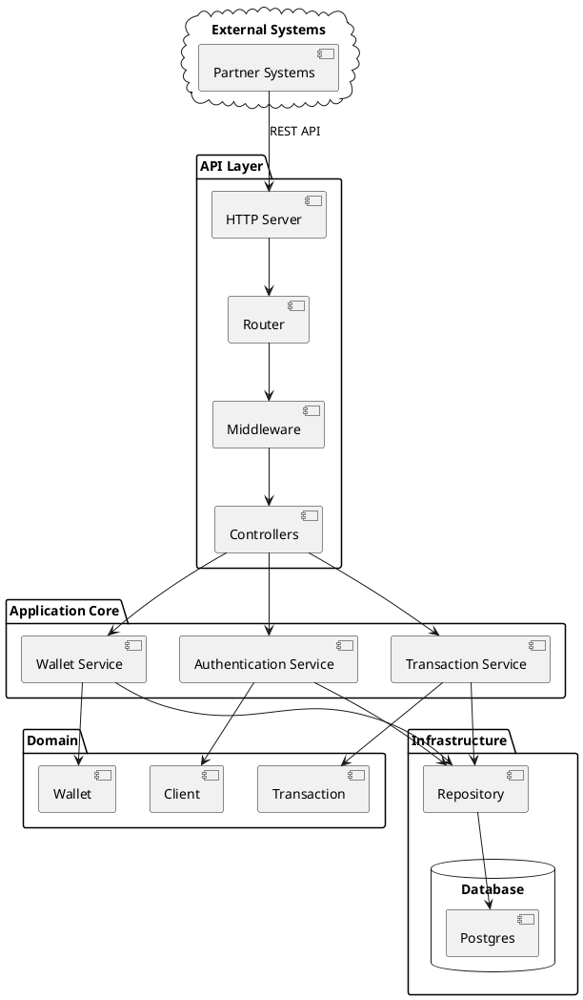

You are tasked with implementing a REST API for a financial institution that provides e-wallet services to its partners. The system has two types of e-wallet accounts: identified and unidentified.

The app uses go, fiber, postgresql with pgx library (don't use orm), docker...

Key points of the API:

1. It should support multiple clients.
2. Use only HTTP POST methods with JSON as the data format.
3. Clients must be authenticated using HTTP header parameters: X-UserId and X-Digest.
4. X-Digest is an HMAC-SHA1 hash of the request body.

E-wallet specifications:
- There should be pre-recorded e-wallets with different balances.
- Maximum balance limits:
  - Unidentified accounts: 10,000 somoni
  - Identified accounts: 100,000 somoni

Data storage: You can choose your preferred method for storing data.

The API should provide the following methods:

1. Check if an e-wallet account exists.
2. Top up an e-wallet.
3. Get the total number and sum of top-up operations for the current month.
4. Get the e-wallet balance.



Here's a folder structure for this architecture:

```
ewallet/
├── .github/
│   └── workflows/
│       ├── go-test.yml
│       └── release.yml
├── cmd/
│   └── api/
│       └── main.go
├── docs/
│   ├── api.md
│   └── swagger.yaml
├── internal/
│   ├── config/
│   │   ├── config.development.yaml
│   │   ├── config.go
│   │   ├── config.production.yaml
│   │   └── config.staging.yaml
│   ├── constants/
│   │   └── constants.go
│   ├── database/
│   │   ├── database.go
│   │   └── database_test.go
│   ├── errors/
│   │   └── errors.go
│   ├── handlers/
│   │   ├── health_handler.go
│   │   ├── health_handler_test.go
│   │   ├── transaction_handler.go
│   │   ├── transaction_handler_test.go
│   │   ├── wallet_handler.go
│   │   └── wallet_handler_test.go
│   ├── logging/
│   │   └── logger.go
│   ├── metrics/
│   │   └── metrics.go
│   ├── middleware/
│   │   └── auth.go
│   ├── models/
│   │   ├── client.go
│   │   ├── client_test.go
│   │   ├── transaction.go
│   │   ├── transaction_test.go
│   │   ├── wallet.go
│   │   └── wallet_test.go
│   ├── repository/
│   │   ├── transaction_repository.go
│   │   └── wallet_repository.go
│   ├── server/
│   │   ├── routes.go
│   │   ├── routes_test.go
│   │   └── server.go
│   ├── services/
│   │   ├── authentication_service.go
│   │   ├── authentication_service_test.go
│   │   ├── transaction_service.go
│   │   ├── transaction_service_test.go
│   │   ├── wallet_service.go
│   │   └── wallet_service_test.go
│   ├── utils/
│   │   └── hmac.go
│   └── validation/
│       └── validator.go
├── scripts/
│   └── seed_data.go
├── tests/
│   └── integration/
│       └── api_test.go
├── .air.toml
├── .env
├── .gitignore
├── .goreleaser.yml
├── docker-compose.yml
├── go.mod
├── go.sum
├── Makefile
└── README.md
```
